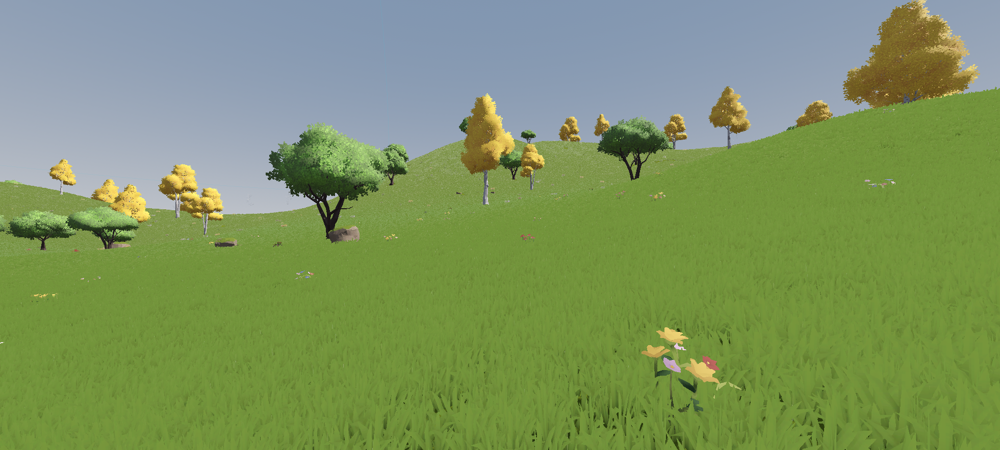

# Foliage3D

Procedural foliage generation for Terrain3D.

**Important**: This addon is in alpha, bugs and breaking changes are to be expected. Always back up your project.

## Getting started

After enabling the plugin, create a *Foliage3D* node below a *Terrain3D* node.
To set bounds, create a *CollisionShape3D* node below *Foliage3D* with either a box or sphere shape
(this will likely be replaced with a custom node in the future).

Once bounds are set, create a graph. Saving to disk is optional but recommended. The graph editor opens in the bottom panel.
Create a *SurfaceSampler* node by right-clicking anywhere and feed its
output into a *MeshSpawner* node. To assign a mesh, click on the *MeshSpawner* and add at least one mesh in the sidebar on the right.
This should spawn meshes in the 3D viewport. Click the save button under *Foliage3D* to save the meshes into your terrain data, or clear to delete them.

## Nodes

#### SurfaceSampler

Sample points from terrain surface within bounds. Point extents sets a bounding box that, for example, can be used to filter overlapping points with the *Difference* and *Prune* nodes.

#### FilterPoint

Filter point position and rotation range. A `0` value equals the respective minimum/maximum value.

#### Transform

Randomize transform offset/rotation/scale.

#### Difference

Remove points in A that overlap with B.

#### Prune

Remove points that overlap with self.

#### MeshSpawner

Spawn meshes.

## Performance

This plugin uses threads and should perform well up to a certain size, but you do
need a good amount of RAM to generate large environments. When you run into problems,
consider using multiple Foliage3D nodes to split up generation.

## Contributing

UX and performance improvements are welcome. This plugin is inspired by Unreal PCG,
however we do not intend to create an exact clone. Features are welcome as well,
but justifications should be provided if they deviate meaningfully from PCG.
